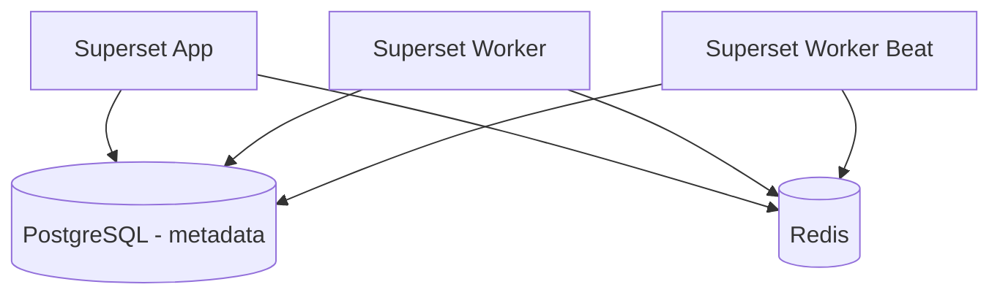

# Apache Superset on Railway

This project provides a ready-to-deploy configuration of [**Apache Superset**](https://superset.apache.org/) on [Railway](https://railway.app).\
It includes support for:

- PostgreSQL (metadata database)
- Redis (caching, Celery, rate-limiting)
- Embedded dashboards using Guest Tokens
- Alerts & Reports (optional, with Playwright screenshot support)
- Environment-driven security headers and CSP configuration

---

## **1. Architecture Overview**



- **Web service**: Runs Gunicorn with Superset web UI and APIs.
- **Celery Worker** *(optional)*: Handles async jobs like SQL Lab queries, alerts, reports.
- **Celery Beat** *(optional)*: Scheduler for periodic tasks like email reports.

---

## **2. Prerequisites**

- Railway account
- Railway PostgreSQL plugin
- Railway Redis plugin
- Custom domain or Railway default domain for embedding

---

## **3. Environment Variables**

Below are the variables you should configure manually in **Railway → Variables**:

| Variable Name                                                                | Required                  | Description                                                                                                        |
| ---------------------------------------------------------------------------- | ------------------------- | ------------------------------------------------------------------------------------------------------------------ |
| `DATABASE_URL`                                                               | ✅                         | Injected automatically when using Railway Postgres plugin                                                          |
| `REDIS_URL`                                                                  | ✅                         | Injected automatically when using Railway Redis plugin                                                             |
| `SECRET_KEY`                                                                 | ✅                         | Strong random key for signing sessions & CSRF tokens                                                               |
| `ADMIN_USERNAME`                                                             | ⚙️ Optional               | Creates a default admin account at first startup                                                                   |
| `ADMIN_EMAIL`                                                                | ⚙️ Optional               | Email for the default admin account                                                                                |
| `ADMIN_PASSWORD`                                                             | ⚙️ Optional               | Password for the default admin account                                                                             |
| `GUEST_TOKEN_JWT_SECRET`                                                     | ✅                         | Strong random secret for signing Embedded Guest Tokens                                                             |
| `GUEST_ROLE_NAME`                                                            | Optional                  | Role assigned to embedded users (default: `Gamma`)                                                                 |
| `GUEST_TOKEN_EXP_SECONDS`                                                    | Optional                  | Expiration time for guest tokens (default: `600`)                                                                  |
| `EMAIL_NOTIFICATIONS`                                                        | Optional                  | Set to `True` to enable email alerts/reports                                                                       |
| `SMTP_HOST` / `SMTP_PORT` / `SMTP_USER` / `SMTP_PASSWORD` / `SMTP_MAIL_FROM` | Optional                  | SMTP config for emails                                                                                             |
| `TALISMAN_ENABLED`                                                           | Optional                  | Default `True`. Controls security headers (CSP, X-Frame-Options).                                                  |
| `FRAME_ANCESTORS`                                                            | ⚙️ Required for embedding | Comma-separated list of allowed embedding origins.Example: `https://frontend.example.com,https://*.up.railway.app` |
| `SERVER_WORKER_AMOUNT`                                                            | Optional                  | Gunicorn worker count (default: 1)                                                                                 |

---

## **4. Deploying to Railway**

1. **Create a new Railway project**.
2. **Add PostgreSQL and Redis plugins** to the project (Railway will inject `DATABASE_URL` and `REDIS_URL` automatically).
3. **Deploy Superset service**:
   - Start Command:
     ```
     ./superset_init.sh
     ```
4. Configure manual environment variables (see table above).
5. Deploy — logs should show Gunicorn listening on `0.0.0.0:$PORT`.

---

## **5. Initial Admin Login**

If you set `ADMIN_USERNAME`, `ADMIN_EMAIL`, and `ADMIN_PASSWORD`, an admin account will be created automatically on the first run.

Example:

```
ADMIN_USERNAME=admin
ADMIN_EMAIL=admin@example.com
ADMIN_PASSWORD=SuperSecret123!
```

Login at:

```
https://<your-superset-service>.up.railway.app
```

---

## **6. Embedded Dashboards Setup**

### Step 1. Enable Embedded Feature

Embedded dashboards are already enabled via:

```python
FEATURE_FLAGS = {
  "EMBEDDED_SUPERSET": True
}
```

### Step 2. Configure Allowed Origins

Set the `FRAME_ANCESTORS` environment variable:

```
FRAME_ANCESTORS=https://frontend.example.com,https://*.up.railway.app
```

### Step 3. Backend Generates Guest Tokens

Your backend service must:

1. Sign a **JWT** using `GUEST_TOKEN_JWT_SECRET`.
2. Call Superset API `/api/v1/security/guest_token` to exchange it for a short-lived guest token.
3. Use this token in the front-end via the Superset Embedded SDK or iframe.

---

## **7. Security Headers (CSP)**

Superset uses Flask-Talisman for security headers.

- **Enable/Disable** via:
  ```
  TALISMAN_ENABLED=True
  ```
- **Dynamic CSP Configuration:**
  ```
  FRAME_ANCESTORS=https://frontend.example.com,https://*.up.railway.app
  ```
- The above allows your frontend domain(s) to embed Superset dashboards via iframe.

---

## **8. Optional Services**

### Celery Worker

For async tasks like SQL Lab queries, alerts, and reports:

```
celery -A superset.tasks.celery_app:app worker --loglevel=INFO
```

### Celery Beat

For scheduled jobs like email reports:

```
celery -A superset.tasks.celery_app:app beat --loglevel=INFO
```

Each runs as a separate Railway service with the **same image** and environment variables.

---

## **9. Logs and Troubleshooting**

### Common Issues

| Problem                           | Solution                                                                      |
| --------------------------------- | ----------------------------------------------------------------------------- |
| `flask_limiter` in-memory warning | Ensure the Redis plugin is attached so `REDIS_URL` is automatically set.      |
| Can't embed dashboard, CSP error  | Check `FRAME_ANCESTORS` is correctly set.                                     |
| No "Embed dashboard" menu         | Confirm `EMBEDDED_SUPERSET=True` and restart.                                 |
| X-Frame-Options blocking iframe   | In `superset_config.py`, set `"frame_options": None` under `TALISMAN_CONFIG`. |
| Admin login fails                 | Run `superset fab create-admin` manually in Railway shell.                    |

---

## **10. Example FRAME\_ANCESTORS for Production**

| Environment                | FRAME\_ANCESTORS Value                                           |
| -------------------------- | ---------------------------------------------------------------- |
| Dev (Railway default)      | `https://*.up.railway.app`                                       |
| Production (custom domain) | `https://your-frontend.example.com,https://superset.example.com` |

---

## **11. License**

Apache Superset is licensed under the **Apache License 2.0**.\
See [LICENSE](https://github.com/apache/superset/blob/master/LICENSE) for details.

---

This README provides everything you need to deploy and run Superset with embedded dashboard support on Railway.

